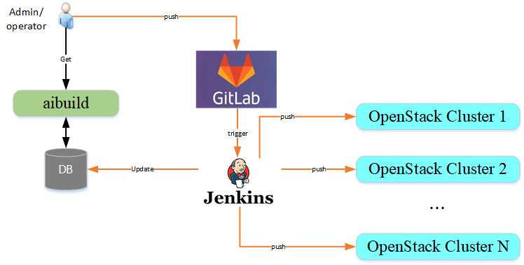

# Automate to build GuestOS images(AIBuild)
[TOC]

## Introduce

### Architecture


1. aibuild服务初始化时，创建相关表格，并监听服务，端口9753
2. 新增一个镜像，编写制作和测试代码，推送到Gitlab
3. Jenkins触发构建流程，构建结束将数据库更新
4. 管理员和运维人员通过API/CLI查看镜像来龙去脉

### DB Design

Database: aibuild

* Table: build_log

| field | type | Null | Key | Default | Extra |
|------|------|------|------|------|------|
|image_uuid|varchar(36)|NO|PRI|NULL||
|image_name|varchar(255)|YES||NULL||
|os_type|varchar(20)|YES||NULL||
|os_ver|varchar(10)|YES||NULL||
|build_at|datetime|YES||NULL||
|from_iso|varchar(255)|YES||NULL||
|update_contents|text|YES||NULL||

* Table: test_log

|field|type|Null|Key|Default|Extra|
|------|------|------|------|------|------|
|image_uuid|varchar(36)|NO|PRI|NULL||
|test_case|varchar(255)|YES||NULL||
|test_result|varchar(10)|YES||NULL||
|test_at|datetime|YES||NULL||

* Table: release_log

|field|type|Null|Key|Default|Extra|
|------|------|------|------|------|------|
|image_uuid|varchar(36)|NO|PRI|NULL||
|openstack_cluster|varchar(60)|YES||NULL||
|glance_id|varchar(36)|YES||NULL||
|release_at|datetime|YES||NULL||


## Install

### gitlab和jenkin均使用容器实现
* Install docker
``` bash
curl -fsSL https://download.docker.com/linux/ubuntu/gpg | sudo apt-key add -
sudo add-apt-repository "deb [arch=amd64] https://download.docker.com/linux/ubuntu $(lsb_release -cs) stable"
apt install apt-transport-https
apt update
apt policy docker-ce
apt install -y docker-ce
systemctl status docker
```

* 部署jenkins
``` bash
# 如下命令用于容器镜像加速
vi /etc/docker/daemon.json
{
  "registry-mirrors": ["https://registry.docker-cn.com"]
}
systemctl restart docker.service
docker pull jenkins
cd /home
docker run -d -p 49001:8080 -v $PWD/jenkins:/var/jenkins_home -t jenkins
chown -R 1000 $(pwd)/jenkins/
docker start 534dba942d5a
```

登录http://172.23.61.5:49001/，按照指示进行操作
初始化密码获取：cat jenkins/secrets/initialAdminPassword
按照建议装插件
配置管理员: admin/Lc13yfwpW

* 部署gitlab
``` bash
docker pull gitlab/gitlab-ce
mkdir -p /home/gitlab/{config,data,logs}
docker run -d \
--hostname gitlab \
--publish 49011:80 \
--name gitlab \
--restart always \
--volume /home/gitlab/config:/etc/gitlab \
--volume /home/gitlab/logs:/var/log/gitlab \
--volume /home/gitlab/data:/var/opt/gitlab \
gitlab/gitlab-ce

```
账户：root/Lc13yfwpW

### aibuild server
* 安装qemu，kvm
``` bash
$ apt install qemu-kvm
```

* Download packer
``` bash
$ https://releases.hashicorp.com/packer/1.2.5/packer_1.2.5_linux_amd64.zip
$ apt install -y unzip
$ unzip packer_1.2.5_linux_amd64.zip
$ ls
packer  packer_1.2.5_linux_amd64.zip
```

* web server
使用apache2搭建web服务器，/var/www/html目录空间至少为2TB，建议使用lvm的方式，方便扩容。分为2个目录
	* build: 构建成功后推送的地方，/var/www/html/images/build
	* release: 测试通过后推送的地方，/var/www/html/images/release

